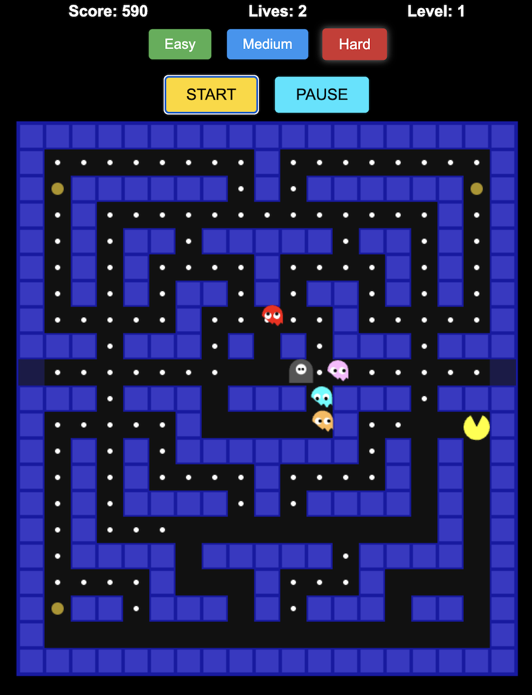

# Pacman 🟡👻

A browser-based Pacman game with multiple difficulty levels, music, and a special Grim Reaper enemy for hard mode!



---

## Features ✨

- **Classic Pacman gameplay** with smooth controls
- **Three difficulty levels:** Easy, Medium, Hard
- **START** and **PAUSE** buttons with distinct colors
- **Keyboard controls:**  
  - Use **arrow keys** to move  
  - Press **Spacebar** or **P** to pause/resume the game
- **Background music** that pauses/resumes with the game
- **Grim Reaper enemy** appears in Hard mode!

---

## Grim Reaper 👹

- The **Grim Reaper** is a special enemy that only appears in Hard mode.
- It is now drawn in a **slightly darker grey** (`#555555`) for better visibility against the game background.
- Behaves similarly to ghosts but is more challenging!

---

## How to Play 🎮

1. **Choose a difficulty** (Easy, Medium, Hard).
2. **Click START** to begin.
3. **Move Pacman** with the arrow keys.
4. **Pause/Resume** with the **Spacebar** or **P** key, or use the PAUSE button.
5. **Eat dots and avoid ghosts** (and the Grim Reaper in Hard mode)!

---

## Development Notes 🛠️

- The Grim Reaper's color can be changed in `js/sprites.js`:
  ```javascript
  this.color = '#555555'; // Slightly darker grey for visibility
  ```
- The game state constants are made global in `js/constants.js` for reliable keyboard controls.
- The spacebar and "P" key are handled robustly to pause/resume the game.

---

Enjoy playing Pacman! 🟡🍒👻